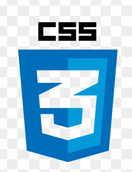
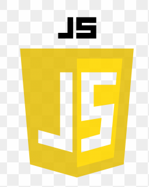
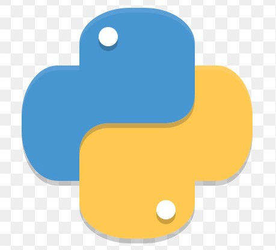
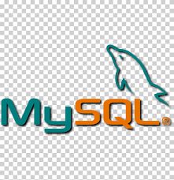
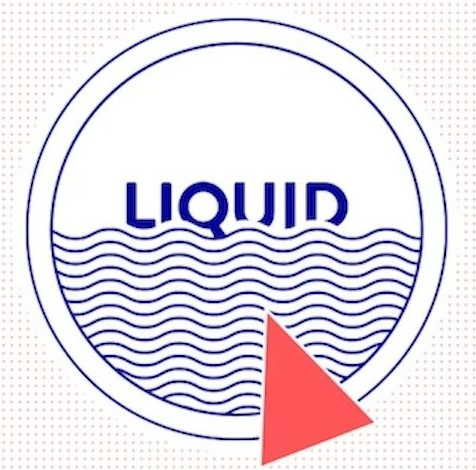

# Hello, folks! 
- 👋 Hi, I’m <b>Sonakshi</b>.
- 👀 I’m a Web/Software Developer from India
- 🌱 I’m currently working as a Web developer and a Open source enthusiast
- 💞️ I’m looking to collaborate in C/C++, Python and web development
- 📫 You can reach me @ sonakshi2500@gmail.com
 

<b> We can connect on linkedin from this link ☞
https://www.linkedin.com/in/sonakshi-mutreja/ </b>

## TECH STACK
 &nbsp;&nbsp;  &nbsp; &nbsp; &nbsp;&nbsp;  &nbsp;&nbsp;  &nbsp; &nbsp; &nbsp;&nbsp;  &nbsp; &nbsp; &nbsp;&nbsp; &nbsp; &nbsp; &nbsp;&nbsp; &nbsp; &nbsp; &nbsp;&nbsp; &nbsp; &nbsp;  &nbsp;&nbsp; &nbsp; &nbsp; &nbsp; &nbsp; &nbsp; &nbsp;

# Github Activity

# Languages Used

